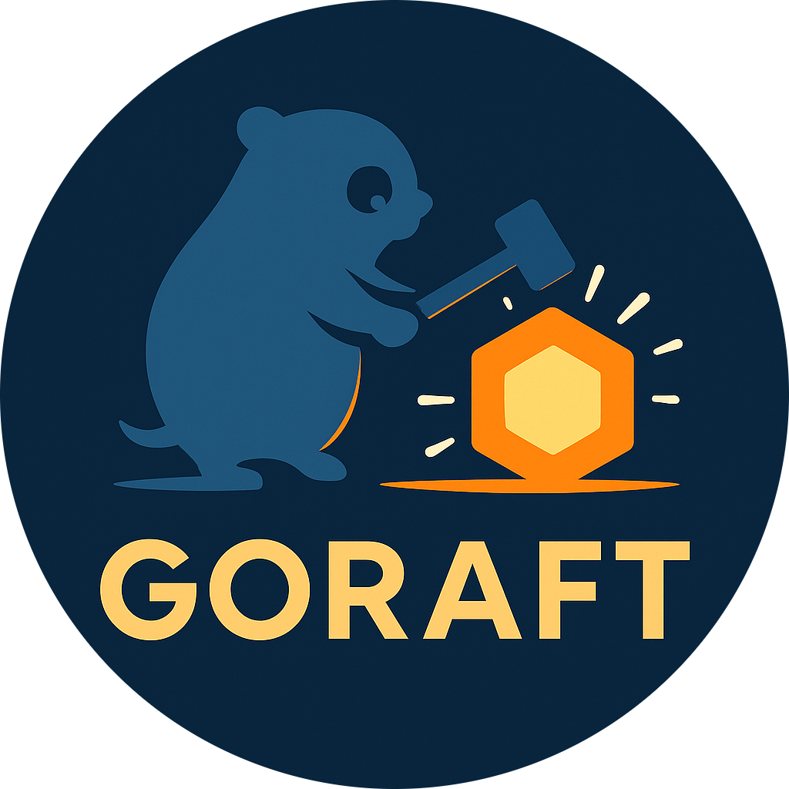

# golang-rest-api-template
Golang RestAPI Template


A Go-based backend rest api service + Hexagonal template.


## 📦 Tech Stack

| Component         | Technology                |
|------------------|---------------------------|
| Language         | [Go](https://golang.org/) |
| API              | RestAPI |
| Web Framework    | [Echo](https://echo.labstack.com/) |
| ORM              | [Ent](https://entgo.io/) |
| Database         | PostgreSQL                |
| Architecture     | Hexagonal (Ports & Adapters) |

## Project Structure

```
.
├── cmd/                             # Entry points ของแต่ละไบนารี (main.go)
│   ├── server/
│   │   └── main.go                  # HTTP server bootstrap
│   ├── worker/
│   │   └── main.go                  # Background worker entry point
│   └── cli/
│       └── main.go                  # CLI tool commands
│
├── pkg/                             # Public libraries ที่เปิดให้ใช้ข้ามโปรเจกต์ 
│
├── internal/
│   ├── core/                        # Business Core ตาม Hexagonal
│   │   ├── domain/                  # Entities & Value Objects
│   │   ├── port/
│   │   │   ├── inbound/             # Inbound Ports Interfaces (e.g. Handler interfaces)
│   │   │   └── outbound/            # Outbound Ports Interfaces (e.g. Repository interfaces)
│   │   └── service/                 # Application Services (Use Cases)
│   │
│   ├── adapters/                    # Secondary Adapters (implement Ports)
│   │   ├── persistence/             # Persistence Adapters (DB, Cache)
│   │   │   ├── postgres/            # PostgreSQL (Ent)
│   │   │   │   └── postgres.go
│   │   │   ├── redis/               # Redis adapter
│   │   │   └── mongo/               # MongoDB adapter
│   │   │
│   │   └── config/                  # Config Loader Adapter (Viper, Env)
│   │       ├── config.dev.yml
│   │       └── config.go
│   │
│   ├── handler/                     # Inbound Adapters (HTTP, Kafka, CLI)
│   │   ├── http/                    # Echo / Gin / Chi routers & controllers
│   │   │   └── router.go            # RegisterRoutes, Middlewares
│   │   └── kafka/                   # Kafka consumers / producers
│   │
│   └── util/                        # Utility packages (logging, middleware)
│
├── protocol/                        # API contracts / specs
│   ├── graphql/                     # GraphQL schema + codegen config
│   │   ├── schema.graphql
│   │   └── gqlgen.yml
│   ├── proto/                       # gRPC / Protobuf definitions
│   │   ├── user.proto
│   │   └── course.proto
│   ├── openapi/                     # OpenAPI / Swagger specs
│   │   ├── openapi.yaml
│   │   └── swagger-config.json
│   └── jsonschema/                  # JSON Schema definitions (optional)
│       ├── user.json
│       └── course.json
│
├── Dockerfile                       # Container build definition
├── docker-compose.yml               # Local development services
├── go.mod                           # Go module definition
└── go.sum                           # Go module checksums
```

## Prerequisites

- Go 1.24 or later
- Docker and Docker Compose
- PostgreSQL

## Getting Started

### Set up environment variables:

   ```bash
   cp .env.example .env
   # Edit .env with your configuration
   ```

### . Run the application:
   ```bash
   go run cmd/server/main.go
   ```

## Development

### Database Migrations

The project uses Ent for database schema management. To create a new migration:

```bash
go generate ./ent
```

## Dependencies

Main dependencies:

- [Echo](https://github.com/labstack/echo) - Web framework
- [Ent](https://entgo.io/) - Entity framework
- [Viper](https://github.com/spf13/viper) - Configuration management
- [Zap](https://go.uber.org/zap) - Logging
- [PostgreSQL](https://www.postgresql.org/) - Database

## Hot Reload 
- (แนะนำ) [air](https://github.com/cosmtrek/air) สำหรับ hot reload

